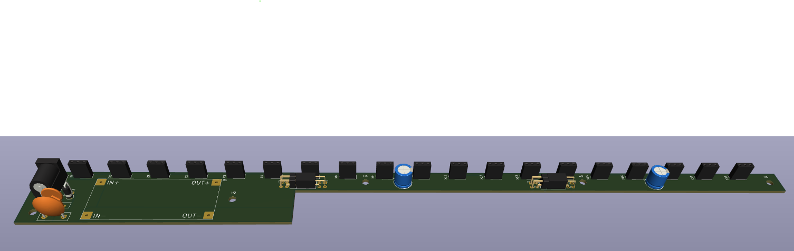

# Hardware

Kleinere Version der Original Campuswochen Wortuhr. 
Das Buchstabenlayout dieser WortUhr ist angelehnt an das Layout, welches von Frank Meyer verwendet wird.

Der Aufbau ist nun kompatibel mit 60 LED/m WS2812B/SK6812 LED Streifen. Um das zu erreichen ist die Rahmengröße reduziert auf 35cm Innenmaß. Hierzu eignet sich zum Beispiel der IKEA SANNAHED 35x35cm Rahmen. Die Steuerplatine ist auf das wesentliche beschränkt, die Stromversorgung übernimmt ein einziges generisches DCDC XL4015 Netzteil. Es wird weiterhin über einen Rundbuchsenanschluss mit 19-21V eingespeist. 

# Software

Die Software von Frank Meyer wurde minimal angepasst. Das Layout der Matrix, sowie die Datenrichtung wurde angepasst.

Documentation: https://www.mikrocontroller.net/articles/WordClock_mit_WS2812

Version: 2.9.5

Copyright (c) 2014-2019 Frank Meyer - frank(at)fli4l.de

This program is free software; you can redistribute it and/or modify it under the terms of the GNU General Public License as published by the Free Software Foundation; either version 2 of the License, or (at your option) any later version.
